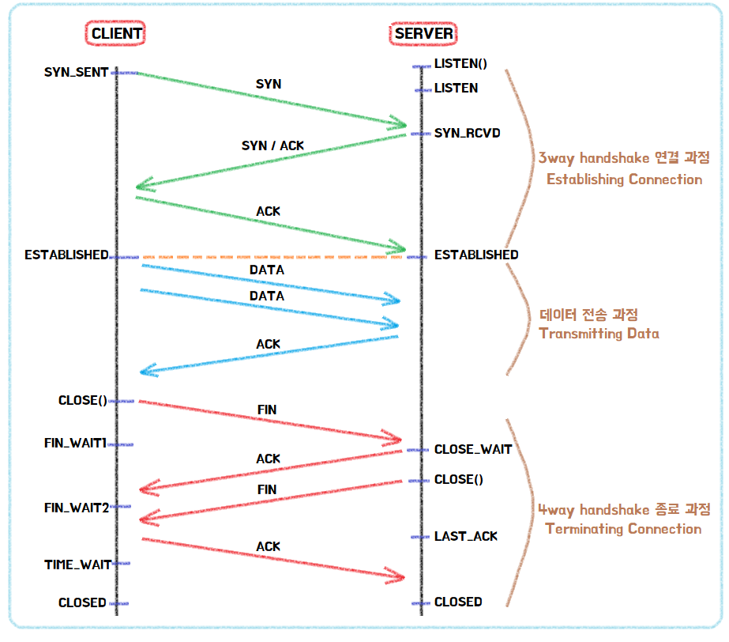

# TCP

## TCP란?
* 연결형 서비스를 지원하는 인터넷 프로토콜
* 연결 및 종료 시 여러 단계에 걸쳐 연결 및 종료를 보장하므로 안정성이 있음

 

## 3-way / 4-way handshake
* TCP에서 접속을 연결 및 종료할 때 이루어지는 3번 또는 4번의 확인 과정
* 패킷을 주고받아 위 과정을 수행함
* 연결 시에는 3-way, 종료 시에는 4-way로 이루어짐
* 연결이나 종료를 시작하는 쪽은 항상 클라이언트 쪽으로, **서버 쪽에서는 먼저 연결을 시작하거나 종료할 수 없음**

### 패킷 의미
* SYN : Synchronize sequence Numbers
* ACK : Acknowledgement

 

## 특징
* 한 번 연결이 성사되고 나면 클라이언트가 종료 신호를 보내기 전까지 계속 연결이 되어 있다고 여겨진다. 따라서 물리적인 문제 등으로 연결이 비정상적으로 끊겨도 TCP 상에서는 문제 없이 연결이 된 것으로 생각해 리소스를 계속 낭비할 수 있다.
* 종료 시 `CLOSE_WAIT`나 `TIME_WAIT` 상태가 해결되지 않으면 사용자 입장에서는 연결이 종료된 것처럼 보이지만 사실은 계속 리소스를 낭비하고 있는 상태이다.
* 위와 같은 문제를 해결하기 위해 **Timeout**을 설정할 수 있다.

 

## UDP와의 차이
* UDP는 TCP와 달리 비연결형 서비스
* UDP는 데이터를 보내거나 받을 때 확인 절차를 거치지 않으므로 속도가 빠르나 신뢰도가 낮음
* TCP는 데이터의 순서가 보장되지만, UDP는 순서가 보장되지 않음