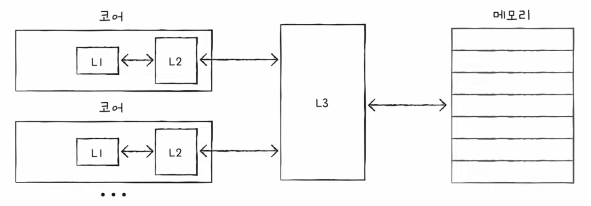

# 캐시 메모리(cache memory)

## 저장 장치 계층 구조(memory hierarchy)
1. CPU와 가까운 저장 장치는 빠르고, 멀리 있는 저장 장치는 느리다
    - ex) 레지스터 > 메모리(RAM) > USB 메모리(빠른 순)
2. 속도가 빠른 저장 장치는 저장 용량이 작고, 가격이 비싸다

즉, CPU에 얼마나 가까운가를 기준으로 저장 장치를 계층적으로 나타낼 수 있음

## 캐시 메모리
- CPU와 메모리 사이에 위치
- 레지스터보다 용량이 크고 메모리보다 빠른 SRAM 기반 저장 장치
- CPU의 연산 속도와 메모리 접근 속도의 차이를 조금이나마 줄이기 위해 탄생
- CPU가 자주 사용할 법한 데이터를 캐시 메모리에 저장해두고 사용함

### 계층적 캐시 메모리
- 캐시 메모리는 CPU 외부에 있을 수도, 내부에 있을 수도 있음
- L1 캐시 : CPU 코어 내부에 있으며 레지스터보다는 용량이 크지만 L2캐시보단 작음
- L2 캐시 : CPU 코어 내부에 있으며 L3 캐시보단 작음
- L3 캐시 : CPU 코어 외부에 있으며 메모리보단 용량이 작지만 L2 캐시보단 큼

멀티코어 프로세서의 경우 아래와 같이 구성되는 경우가 많음

- 코어마다 다른 캐시 메모리를 갖기 때문에 각 코어의 캐시가 다른 내용을 저장하게 될 수도 있음
- L1 캐시(가장 빠른 캐시 메모리)의 경우 조금이라도 더 빠르게 만들기 위해 분리하는 경우도 있음
    - L1D : 데이터(Data)만을 담기 위한 L1 캐시
    - L1I : 명령어(Instruction)만을 담기 위한 L1 캐시

## 참조 지역성의 원리(Locality of Reference)
- 캐시 메모리는 메모리보다 용량이 작기 때문에 당연하게도 메모리의 모든 내용을 저장할 수 없음
- 따라서 일부 내용만 복사해서 가져옴
- 즉, **CPU가 자주 사용할 법한 내용을 예측해서 저장**
- CPU는 다음과 같은 경향을 가짐
    1. CPU는 최근에 접근했던 메모리 공간에 다시 접근하려는 경향이 있다
    2. CPU는 접근한 메모리 공간 근처를 접근하려는 경향이 있다
    위와 같은 경향성을 바탕으로 데이터를 미리 가져와 저장함

### 캐시 히트
- 예측이 들어맞는 경우. 즉, CPU가 캐시 메모리에 저장된 값을 활용한 경우
- 성능이 올라감

### 캐시 미스
- 예측이 틀렸을 경우. 즉, CPU가 메모리에 접근해야 하는 경우
- 성능이 떨어짐

### 캐시 적중률
`캐시 히트 횟수 / (캐시 히트 횟수 + 캐시 미스 횟수)`

## Reference
- <https://www.youtube.com/watch?v=qLCP0PwRp_w&list=PLVsNizTWUw7FCS83JhC1vflK8OcLRG0Hl&index=19>