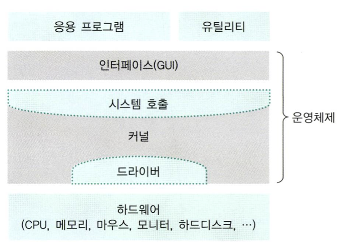

# 운영체제의 구조

### 커널(kernal)
- 프로세스 관리, 메모리 관리, 저장장치 관리 같은 OS의 핵심적인 기능을 모아놓은 것
- 안드로이드는 커널 공개, iOS는 유닉스 커널 기반이지만 커널을 공개하지 않음

### 인터페이스(interface)
- 커널에 사용자의 명령을 전달하고 실행 결과를 사용자에게 알려주는 역할
- ex) 유닉스 shell

### 시스템 호출(system call)
- 커널이 자신을 보호하기 위해 만든 인터페이스
- 자원을 이용하려면 사용자나 응용 프로그램은 시스템 호출을 통해 접근해야 함
- ex) 유닉스 write() 함수

### 드라이버(driver)
- 커널과 하드웨어의 인터페이스
- 커널이 제공하는 드라이버도 있고, 하드웨어 제작자가 제공하는 드라이버도 있음
- ex) 마우스, 키보드, 그래픽카드, 프린터 드라이버

## Reference
* 쉽게 배우는 운영체제 - 조성호