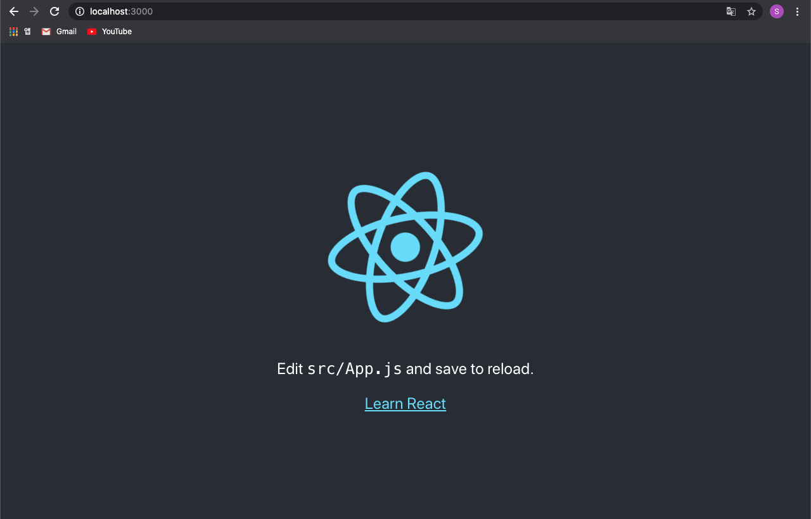

# React

## React란?
* facebook에서 만든 JavaScript 라이브러리
* 기본적으로 js 파일과 css 파일들의 묶음임
* **컴포넌트**라는 단위를 이용하여 UI 구성
* Interactive한 UI 구성이 쉽게 가능하기 때문에 one-page-app을 만드는 데에 많이 사용됨

<br>

## React 시작하기
### 새 React 프로젝트 만들기
> [새로운 React 앱 만들기](https://ko.reactjs.org/docs/create-a-new-react-app.html#create-react-app)
1. npx로 프로젝트 생성  
    * `npx create-react-app my-app`
        * **npx** : npm 5.2+ 버전의 패키지 실행 도구
        * `create-react-app` : 새 React 앱을 생성하는 공식 명령어
        * `my-app` : 생성할 프로젝트의 이름
    * 뭔가 엄청 많이 설치하면서 좀 시간 걸림
2. 생성된 폴더 내부로 이동  
    * `cd my-app`
3. 앱 실행  
    * `npm start`
    * 실행 성공 시 다음과 같은 화면을 볼 수 있음
        * 터미널  
        
        * 브라우저  
        
### Hello World
```jsx
ReactDOM.render(
    <h1> Hello, world!</h1>
    document.getElementById('root')
);
```
* `ReactDOM.render()`는 2개의 인자를 받아서 html 화면을 렌더링해줌
    * 첫 번째 인자 : 렌더링할 DOM
    * 두 번째 인자 : 첫 번째 인자가 들어가야 할 html 요소
* 위 예제는 `id`가 `root`인 html 요소를 찾아 `<h1>Hello, world!</h1>`를 그 안에 넣어 렌더링해주는 기능을 함
* 보통 `ReactDOM.render()`를 한 번만 호출함
* 렌더링을 변경할 경우, React DOM은 현재의 엘리먼트 상태와 이전의 엘리먼트 상태를 비교하여 **필요한 부분만 변경함**

<br>

## Reference
* <https://ko.reactjs.org/tutorial/tutorial.html>