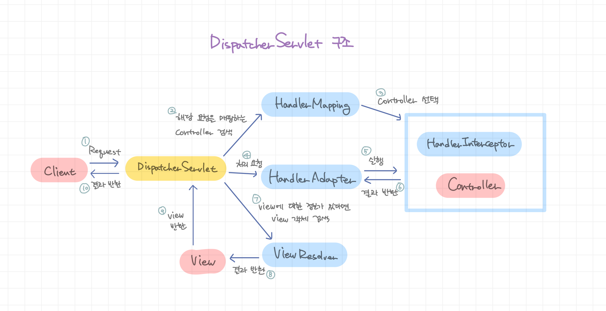

# Servlet

## Servlet이란?
* Java로 구현된 CGI(Common Gateway Interface)
    * CGI : 웹 서버에서 클라이언트의 요청에 응답하기 위해 사용되는 인터페이스로, 언어에 구애받지 않고 확장해서 이용 가능([위키피디아 설명](https://ko.wikipedia.org/wiki/%EA%B3%B5%EC%9A%A9_%EA%B2%8C%EC%9D%B4%ED%8A%B8%EC%9B%A8%EC%9D%B4_%EC%9D%B8%ED%84%B0%ED%8E%98%EC%9D%B4%EC%8A%A4))
* 웹 서버에서 돌아가는 Java 코드라고 볼 수 있음. 클라이언트 요청에 대해 동적으로 페이지를 생성하고 응답을 돌려주는 기능을 함
* 클라이언트의 요청 별로 스레드가 생성되기 때문에 멀티스레드에 대한 동기화 처리가 필요함
* 매핑될 url별로 하나씩 전부 만들어줘야 함

### Servlet Container
* WAS에 존재하는 Servlet을 관리하는 컨테이너
* 클라이언트에서 접근하는 URL을 알맞은 Serlvet에 매핑해줌
* Servlet Lifecycle 관리, 멀티스레드 관리, 보안 관리 등

### Servlet Lifecycle
1. `init()`
    * WAS 로드 후 해당 Servlet에 대해 최초로 요청이 들어올 때 실행됨
    * 주로 Servlet 객체에 대한 초기화 로직 작성
2. `service()`
    * Servlet 객체 생성 이후 `doGet()`, `doPost()` 등의 메소드 실행
3. `destroy()`
    * WAS shutdown 시 호출됨
    * Servlet 객체에서 사용되던 자원이 해제되어 GC에서 처리

### Servlet 구현 방법
* `Servlet`, `GenericServlet`, `HttpServlet` 등을 상속받아 구현할 수 있음
* `init()`, `destroy()`, `doGet()` 등의 메소드들을 구현해주면 됨
* web.xml에 `<servlet-mapping>` 태그를 쓰거나 `@Configuration`을 사용하여 url 패턴을 매핑시킬 수 있음

 

## Dispatcher Servlet
* url 별로 매핑될 Servlet이 각각 존재하고 이를 각각의 controller와 매핑 시 너무 귀찮고 유지보수가 힘듦
* 그래서 단 하나의 FrontControllerServlet을 만들어 두고 모든 클라이언트의 요청을 받아 각각의 controller와 매핑시켜주는 방법을 사용
* Dispatcher Servlet은 **Spring에서 정의해 둔 FrontController**

### Dispatcher Servlet의 구조

* `DispatcherServlet`은 `FrameworkServlet`을 상속받고 있으며, `FrameworkServlet`은 `HttpServlet`을 상속받고 있음
* 요청이 들어오면 `FrameworkServlet.service()`가 호출되고, 이는 다시 `DispatcherServlet.doService()`를 호출
* `doService()`에서 다시 `doDispatch()`를 호출하고, 이 안에는 `HandlerMapping`, `HandlerAdapter`, `ViewResolver` 등을 호출하는 로직이 있음

### Spring Boot에서의 Dispatcher Servlet 작동 방식
* Spring Boot에는 내장된 톰캣이 있으며, 이 톰캣이 실행되고 DispatcherServlet의 빈 등록이 자동으로 이루어짐
* Controller들은 이미 생성되어 빈으로 등록되어 있으므로 요청에 따라 그때그때 생성되지 않고 초기에 DispatcherServlet에 핸들러 매핑 자원으로 등록됨

 

## Reference
* <https://kohen.tistory.com/29>
* <https://jaehun2841.github.io/2018/09/01/2018-09-01-servlet/>
* <https://12bme.tistory.com/555>
* <https://galid1.tistory.com/525>